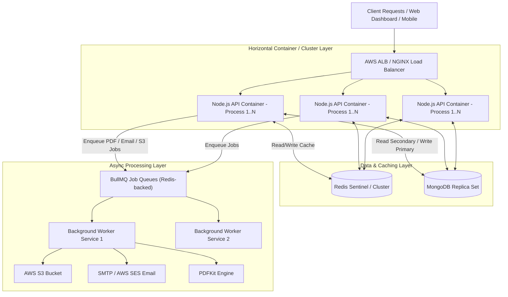

# MedFlow Architecture Guidelines: Scaling for Millions of Requests

This document outlines the enterprise architectural guidelines, infrastructure topologies, data caching strategies, background worker patterns, and load testing frameworks required to scale **MedFlow** for high throughput (handling millions/billions of requests with API response times under 50ms).

---

## 🏗️ High-Throughput System Architecture Topology



---

## STEP 1: Multi-Core & Multi-Container Horizontal Scaling

By default, Node.js runs on a single thread. To utilize all CPU cores on a host machine and scale horizontally across multiple server nodes:

### 1.1 Local Multi-Core Scaling: PM2 & Node.js Cluster Mode
Run Node.js in Cluster Mode via PM2 to instantiate a worker process per CPU core.

Create `ecosystem.config.cjs` in the root directory:

```javascript
module.exports = {
  apps: [{
    name: 'medflow-api',
    script: './apps/api/dist/server.js',
    instances: 'max', // Spawns 1 worker per CPU core
    exec_mode: 'cluster',
    env: {
      NODE_ENV: 'production',
      PORT: 4000
    }
  }]
};
```

**Run Command:**
```bash
npx pm2 start ecosystem.config.cjs
```

---

### 1.2 Multi-Container Scaling (Docker Compose / Kubernetes HPA)
Modify [`docker-compose.prod.yml`](../docker-compose.prod.yml) to configure container replicas and resource boundaries so NGINX can dynamically load-balance incoming HTTP requests:

```yaml
  api:
    build:
      context: .
      dockerfile: apps/api/Dockerfile
    image: medflow-api:prod
    deploy:
      replicas: 4 # Scales to 4 api container instances
      resources:
        limits:
          cpus: '1.5'
          memory: 2048M
    environment:
      - NODE_ENV=production
      - MONGO_URI=mongodb://mongo1:27017,mongo2:27017,mongo3:27017/medflow_prod?replicaSet=rs0
      - REDIS_URL=redis://redis:6379
    depends_on:
      - mongo
      - redis
    networks:
      - medflow-network
```

---

### 1.3 Load Balancer Layer (NGINX / AWS ALB)
Ensure NGINX load-balances traffic evenly using Round-Robin or Least Connections with Sticky Sessions (for Socket.IO WebSocket support).

Update `infra/nginx/nginx.conf`:

```nginx
upstream medflow_api_cluster {
    ip_hash; # Sticky sessions for Socket.IO real-time connections
    server api:4000 max_fails=3 fail_timeout=30s;
}

server {
    listen 80;
    server_name api.medflow.internal;

    location / {
        proxy_pass http://medflow_api_cluster;
        proxy_http_version 1.1;
        proxy_set_header Upgrade $http_upgrade;
        proxy_set_header Connection "upgrade";
        proxy_set_header Host $host;
        proxy_set_header X-Real-IP $remote_addr;
        proxy_set_header X-Forwarded-For $proxy_add_x_forwarded_for;
    }
}
```

---

## STEP 2: Database & Cache Layer Optimization

### 2.1 MongoDB Replica Set & Indexing Strategy
MongoDB must run as a **3-node Replica Set** to support high read throughput (reading from secondaries) and high availability.

1. **Compound Indexes:** Ensure Mongoose schemas (e.g., Prescriptions, Patients, Appointments) have compound indexes matching query access patterns.
```typescript
// Searching prescriptions by hospital and creation date
prescriptionSchema.index({ hospitalId: 1, createdAt: -1 });

// Searching patient records by tenant & medical record number (MRN)
patientSchema.index({ hospitalId: 1, mrn: 1 }, { unique: true });
```

2. **Read Preference Configuration:** Update database connection options to direct read queries to secondary replicas:
```typescript
await mongoose.connect(process.env.MONGO_URI, {
  readPreference: 'secondaryPreferred', // Offloads read queries from Primary DB node
  maxPoolSize: 100,                     // Supports high concurrent connection pool
  minPoolSize: 10
});
```

---

### 2.2 Redis Cache Layer for Read Routes
Implement the **Cache-Aside Pattern** for frequently accessed read endpoints (e.g., Hospital profiles, Doctor schedules, Patient history).

```typescript
import { redis } from '../lib/redis.js';

export async function getHospitalDetails(hospitalId: string) {
  const cacheKey = `hospital:${hospitalId}`;
  
  // 1. Try fetching from Redis Cache
  const cachedData = await redis.get(cacheKey);
  if (cachedData) {
    return JSON.parse(cachedData);
  }

  // 2. Cache Miss: Fetch from MongoDB
  const hospital = await HospitalModel.findById(hospitalId).lean();
  
  // 3. Save to Redis with a TTL (e.g., 1 hour / 3600 seconds)
  if (hospital) {
    await redis.setex(cacheKey, 3600, JSON.stringify(hospital));
  }

  return hospital;
}
```

> [!TIP]
> Always invalidate or delete the cache key when a write/update mutation occurs (`await redis.del(\`hospital:${hospitalId}\`)`).

---

## STEP 3: Asynchronous Background Workers (BullMQ + Redis)

Synchronous tasks like generating PDF prescriptions with PDFKit, uploading them to AWS S3, and sending emails via Nodemailer block the Node.js event loop and cause latency spikes (500ms–2000ms).

Offloading these tasks to BullMQ reduces API latency to **< 50ms**.

### 3.1 Setup BullMQ Queue Producer in API
Create a dedicated queue producer service (`apps/api/src/messaging/queues.ts`):

```typescript
import { Queue } from 'bullmq';
import { redisConnection } from '../lib/redis.js';

export const prescriptionQueue = new Queue('prescription-processing', {
  connection: redisConnection,
  defaultJobOptions: {
    attempts: 3,
    backoff: { type: 'exponential', delay: 2000 },
    removeOnComplete: true
  }
});
```

---

### 3.2 Update API Route Handler (Instant Response)
In your Express controller handler:

```typescript
export async function createPrescription(req: Request, res: Response) {
  // 1. Save lightweight record in MongoDB (< 20ms)
  const prescription = await PrescriptionModel.create(req.body);

  // 2. Offload heavy PDF generation, AWS S3 upload, and email delivery to BullMQ (< 5ms)
  await prescriptionQueue.add('generate-pdf-and-email', {
    prescriptionId: prescription._id,
    patientEmail: req.body.patientEmail,
    hospitalId: req.body.hospitalId
  });

  // 3. Return immediate 202 Accepted response (< 30ms total)
  return res.status(202).json({
    success: true,
    message: 'Prescription creation queued successfully',
    prescriptionId: prescription._id
  });
}
```

---

### 3.3 Create Worker Service (`apps/api/src/workers/prescriptionWorker.ts`)
Run workers as an independent process/container so PDF rendering CPU spikes never slow down API HTTP request handling:

```typescript
import { Worker } from 'bullmq';
import { generatePdfBuffer } from '../lib/pdf.js';
import { uploadToS3 } from '../lib/s3.js';
import { sendEmail } from '../lib/email.js';

const worker = new Worker('prescription-processing', async (job) => {
  const { prescriptionId, patientEmail } = job.data;

  // 1. Generate PDF (CPU intensive)
  const pdfBuffer = await generatePdfBuffer(prescriptionId);

  // 2. Upload to AWS S3 (I/O intensive)
  const s3Url = await uploadToS3(`prescriptions/${prescriptionId}.pdf`, pdfBuffer);

  // 3. Send Email Notification
  await sendEmail({
    to: patientEmail,
    subject: 'Your Prescription PDF',
    attachments: [{ filename: 'prescription.pdf', content: pdfBuffer }]
  });

  return { s3Url };
}, { connection: redisConnection, concurrency: 10 });
```

---

## STEP 4: Professional Load Testing & Benchmarking

Do not run load tests from your local developer machine or Postman Desktop GUI (which hits local OS socket limits). Use dedicated headless load generators on cloud VMs (e.g., AWS EC2/ECS).

### 4.1 Scripting Load Tests with **k6**
Create a k6 load test script (`tests/load/api-load-test.js`):

```javascript
import http from 'k6/http';
import { check, sleep } from 'k6';

export const options = {
  stages: [
    { duration: '1m', target: 500 },  // Ramp-up to 500 Virtual Users
    { duration: '3m', target: 2000 }, // Sustain 2,000 Virtual Users (~20,000 req/sec)
    { duration: '1m', target: 0 },    // Ramp-down
  ],
  thresholds: {
    http_req_duration: ['p(95)<50'], // 95% of requests must complete in < 50ms
    http_req_failed: ['rate<0.01'],  // Less than 1% failure rate
  },
};

export default function () {
  const res = http.get('http://api.medflow.internal/api/v1/health');
  check(res, { 'status is 200': (r) => r.status === 200 });
  sleep(0.1);
}
```

Run headless distributed load test:
```bash
k6 run --out influxdb=http://localhost:8086/k6 tests/load/api-load-test.js
```

---

### 4.2 Postman CLI / Newman in CI/CD Automation
Integrate Newman into your Jenkins Pipeline ([`Jenkinsfile`](../Jenkinsfile)) or GitHub Actions to prevent performance regressions:

```bash
npx newman run tests/postman/MedFlow_API_Collection.json \
  -e tests/postman/prod_environment.json \
  --bail \
  --reporters cli,junit
```

---

## 🎯 Summary Execution Checklist

| Phase | Milestone | Tools / Tech | Target Metric |
| :--- | :--- | :--- | :--- |
| **Phase 1** | Node.js Cluster + NGINX LB | PM2, Docker Compose (`deploy.replicas`), NGINX | 100% CPU core utilization across nodes |
| **Phase 2** | DB Compound Indexes & Redis Caching | MongoDB Indexing, Redis Cache-Aside | Database query time < 10ms |
| **Phase 3** | Offload PDF, S3, SMTP to Workers | BullMQ, Redis Queues, Isolated Worker Process | API HTTP response time < 50ms |
| **Phase 4** | Headless Cloud Load Testing | k6, Newman, Grafana Dashboard | Zero request drops at 10,000+ RPS |
