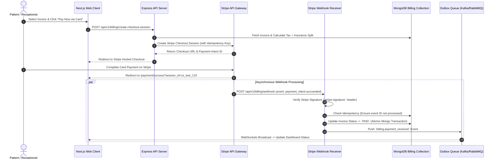
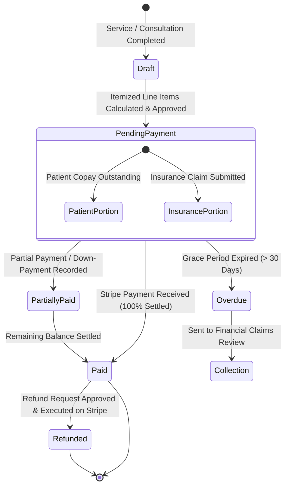
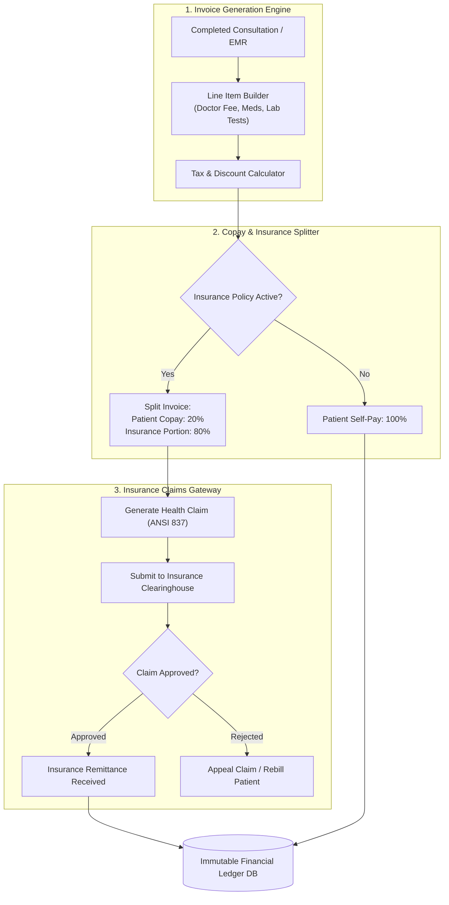

# Billing Engine, Stripe Payment Gateway & Financial Ledger Architecture

This document defines the architectural specifications for invoice generation, insurance copay splitting, Stripe payment processing, webhook idempotency, and financial auditing in **MedFlow**.

---

## 1. Automated Billing & Stripe Webhook Lifecycle

MedFlow automates patient billing upon consultation or service completion, providing seamless integration with the Stripe Payment Gateway.

---

## 2. Invoice Financial State Transitions

An invoice transitions through well-defined lifecycle states from initial drafting to settlement or insurance claim adjustment.

---

## 3. Financial Audit & Insurance Claim Processing Pipeline

MedFlow handles insurance claims by generating standard ANSI 837 health claim formats and tracking insurance reimbursement reconciliation.

---

## 4. Financial Calculations & Idempotency Rules

### 1. Payment Idempotency
All payment creation requests pass a unique `Idempotency-Key` header generated as `idempotency:billing:{hospitalId}:{invoiceId}:{timestamp_hour}`. This prevents double-charging in network timeout scenarios.

### 2. Copay Split Formula
$$\text{Total Invoice} = \sum (\text{Service Line Price} \times \text{Quantity}) + \text{Tax}$$
$$\text{Patient Copay} = \min(\text{Total Invoice}, \text{Deductible Remaining}) + (\text{Remaining Balance} \times \text{Coinsurance Rate})$$
$$\text{Insurance Liability} = \text{Total Invoice} - \text{Patient Copay}$$

### 3. Stripe Signature Security
Webhook requests without a valid `stripe-signature` cryptographically matched against the `STRIPE_WEBHOOK_SECRET` environment key are rejected with HTTP 400 Bad Request.
