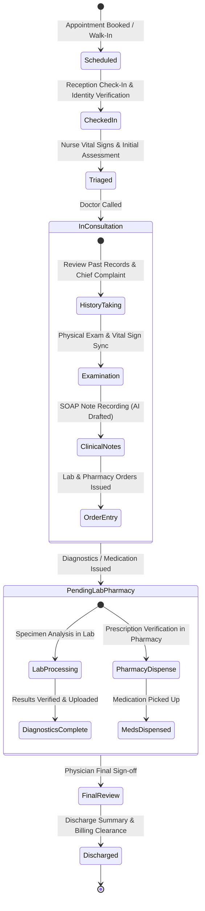
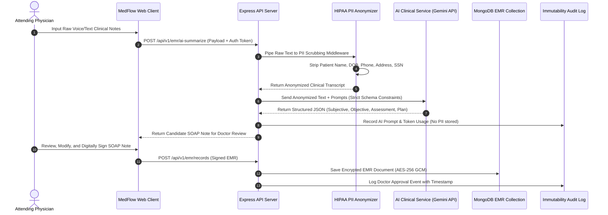
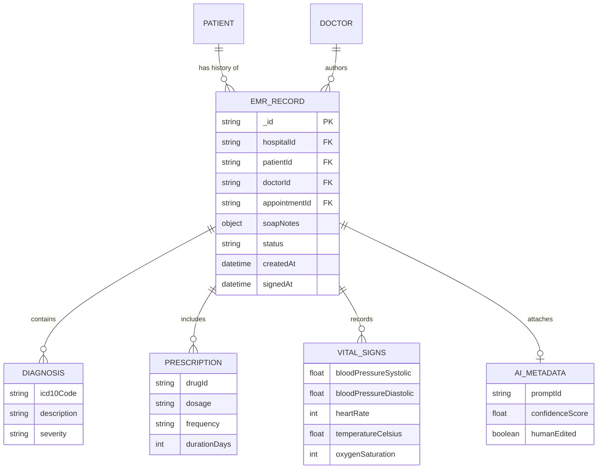

# Clinical Care Pathways, Electronic Medical Records (EMR) & AI Governance

This document defines the architectural specification, data model standards, patient care state transitions, and AI-assisted clinical documentation governance for the **MedFlow Hospital Management System**.

---

## 1. Patient Lifecycle & Clinical Care Pathway

The patient journey through clinical departments progresses through strict operational stages to ensure patient safety, data integrity, and compliance.

### Key Care Pathway Stages:
1. **Reception Check-In**: Patient identity verified against National ID / Health Insurance card. Patient status updated to `CHECKED_IN`.
2. **Nurse Triage**: Nurse logs vital signs (Heart rate, Blood Pressure, SpO2, Temperature, Respiratory Rate). Emergency Severity Index (ESI) computed automatically.
3. **Doctor Consultation**: Doctor conducts SOAP (Subjective, Objective, Assessment, Plan) consultation. AI Clinical Copilot listens or processes raw notes into structured format.
4. **Order Entry & Execution**: Lab tests and medication orders are dispatched asynchronously via MongoDB atomic transactions and WebSocket event broadcasts.
5. **Physician Final Sign-off**: EMR entry locked; digital signature applied; encrypted entry committed.

---

## 2. AI Clinical Copilot & HIPAA Governance

The AI Clinical Copilot automates clinical transcription and SOAP note generation while maintaining strict HIPAA compliance and zero-leakage PII policies.

### Clinical AI Rules:
- **Human-in-the-Loop**: AI outputs are *never* committed directly to patient records without explicit physician verification and signature.
- **Data Scrubbing**: Middleware strips 18 HIPAA PII identifiers before sending prompts out-of-process.
- **Audit Traceability**: Every generated prompt and response is logged in the `AuditLog` collection with model details, execution latency, and token consumption.

---

## 3. EMR Data Architecture & Entity Relationships

The EMR system utilizes tenant-isolated documents indexed for sub-50ms retrieval.

---

## 4. Encryption & Security Standards for EMR

1. **Field-Level Encryption (FLE)**: Sensitive fields within `soapNotes` (e.g. `subjective`, `assessment`) are encrypted prior to insertion into MongoDB using AES-256-GCM.
2. **Access Control**: EMR view access requires valid JWT with explicit role authorization (`DOCTOR`, `NURSE`, or self-service `PATIENT` for their own records only).
3. **Retention & Archival**: Records soft-deleted (`deletedAt != null`) are preserved for a mandatory 7-year retention period per healthcare compliance regulations.
