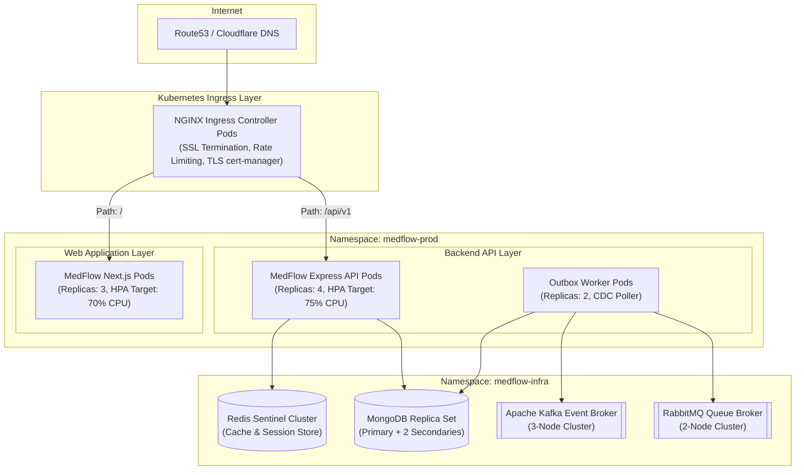
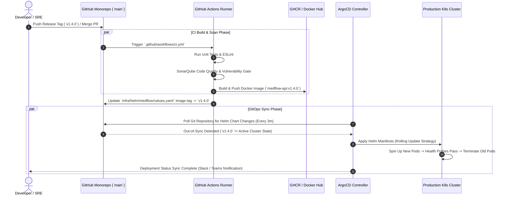
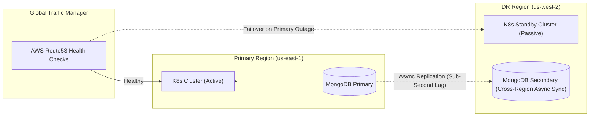

# Kubernetes Infrastructure, GitOps & CI/CD Deployment Architecture

This document defines the production Kubernetes topology, Helm chart structure, ArgoCD GitOps continuous deployment pipeline, and disaster recovery specifications for **MedFlow**.

---

## 1. Kubernetes Production Cluster Topology

MedFlow is deployed into a multi-tenant, high-availability Kubernetes cluster configured with NGINX Ingress, Horizontal Pod Autoscalers (HPA), and isolated namespaces.

---

## 2. GitOps Continuous Deployment Pipeline (ArgoCD & Helm)

MedFlow follows a declarative GitOps workflow. Any commit pushed to `main` triggers automated container building, security scanning, Helm chart updates, and ArgoCD synchronization.

---

## 3. High-Availability Failover & Disaster Recovery (DR)

MedFlow maintains strict RTO (Recovery Time Objective) and RPO (Recovery Point Objective) metrics.

### Reliability Targets:
* **Recovery Time Objective (RTO)**: `< 15 minutes` (Automated DNS failover).
* **Recovery Point Objective (RPO)**: `< 1 minute` (Continuous Mongo Write-Ahead Log replication).
* **Pod Disruption Budgets (PDB)**: `minAvailable: 2` across API and Web deployments.
* **Auto-Scaling Criteria**: HPA triggers scale-out when CPU exceeds 70% or memory exceeds 80% over a 3-minute window.
