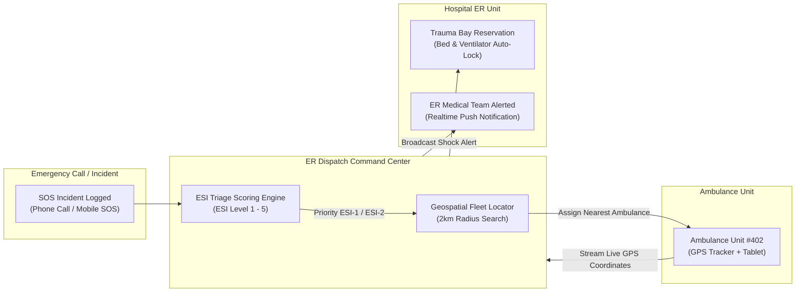
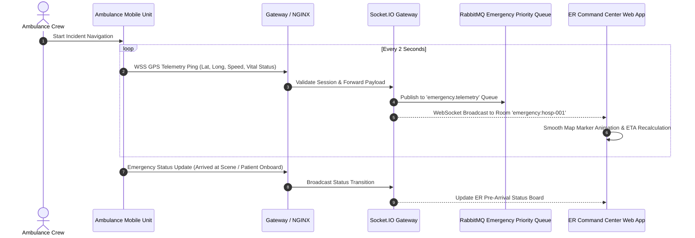
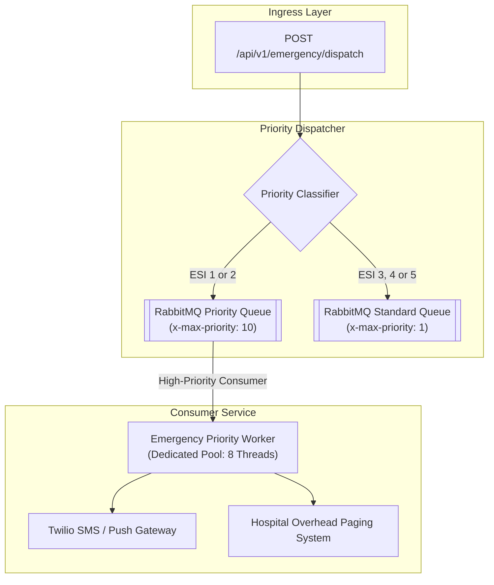

# Emergency Department Triage & Ambulance Fleet Dispatch

This document details the emergency response architecture, Emergency Severity Index (ESI) triage algorithm, real-time GPS fleet telemetry relay, and high-priority event handling in **MedFlow**.

---

## 1. Emergency Incident Triage & GPS Dispatch Flow

When an emergency incident is logged, sub-second dispatch and triage prioritization occur in parallel.

### Emergency Severity Index (ESI) Triage Classification Matrix:

| ESI Level | Category | Description & Clinical Condition | SLA Response Target | Bed Allocation |
| :--- | :--- | :--- | :--- | :--- |
| **ESI-1** | Resuscitation | Immediate life support needed (Cardiac Arrest, Severe Trauma) | `< 0 seconds` (Immediate) | Resuscitation / Trauma Bay 1 |
| **ESI-2** | Emergent | High risk, confused/lethargic, severe pain (Chest Pain, Stroke) | `< 10 minutes` | ER Acute Bed |
| **ESI-3** | Urgent | Requires multiple resources, vital signs stable | `< 30 minutes` | ER Standard Bed |
| **ESI-4** | Less Urgent | Requires 1 resource (X-Ray or Simple Stitches) | `< 60 minutes` | Fast-Track Clinic |
| **ESI-5** | Non-Urgent | No resources required (Prescription Refill, Minor Wound) | `< 120 minutes` | Outpatient Clinic |

---

## 2. Real-Time Telemetry Broadcast Sequence

Ambulance GPS telemetry is broadcasted via WebSockets to the ER Command Center map view every 2 seconds.

---

## 3. High-Priority Emergency Event Architecture

Emergency events override standard event queues by utilizing high-priority dedicated RabbitMQ channels and dedicated Kafka partitions.

---

## 4. Ambulance Equipment & Medication Readiness

Every ambulance unit maintains an immutable checklist logged prior to shift start:
* **Life Support**: Defibrillator/AED (battery > 90%), Portable Ventilator, Oxygen Cylinders (> 1500 PSI).
* **Medications**: Epinephrine 1mg/ml, Atropine, Morphine, Nitroglycerin, Saline Solution.
* **Telemetry**: 5G Dual-SIM failover router, encrypted GPS transponder, portable tablet scanner.
