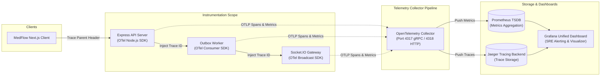
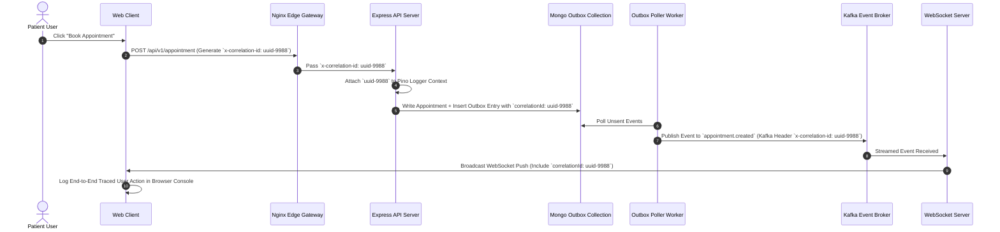

# Observability, Distributed Tracing & Telemetry Architecture

This document defines the distributed tracing architecture, OpenTelemetry collector configuration, Prometheus metric aggregation, Jaeger trace visualization, and correlation ID propagation across **MedFlow**.

---

## 1. End-to-End Distributed Telemetry Pipeline

MedFlow employs OpenTelemetry (OTel) instrumentation across HTTP REST, MongoDB queries, Redis cache lookups, Kafka event streaming, RabbitMQ message queues, and WebSocket broadcasts.

---

## 2. Correlation ID Propagation Lifecycle

Every request entering the system receives a unique correlation ID (`x-correlation-id`) that is propagated across network boundaries, microservices, database operations, and logs.

---

## 3. SRE Key Performance Indicators (SLOs & Metrics)

The system exports key Prometheus metrics monitored continuously in Grafana:

### Core System Metrics:
* `http_request_duration_seconds_bucket`: Latency histogram partitioned by `route`, `status_code`, and `method`.
* `websocket_active_connections_count`: Gauge tracking concurrent live Socket.IO connections.
* `outbox_unsent_events_total`: Gauge monitoring pending CDC events in MongoDB outbox queue.
* `redis_cache_hit_ratio`: Ratio of `keyspace_hits / (keyspace_hits + keyspace_misses)`.
* `database_transaction_duration_ms`: Latency of MongoDB session transactions.

### Service Level Objectives (SLOs):
1. **API Latency**: 95% of HTTP requests return in `< 500ms`.
2. **WebSocket Dispatch Latency**: 99% of outbox events are broadcasted to WebSockets in `< 200ms`.
3. **Availability**: `99.9%` uptime measured over a rolling 30-day window.
4. **Error Budget**: Maximum 0.1% HTTP 5xx responses per 100,000 requests.
