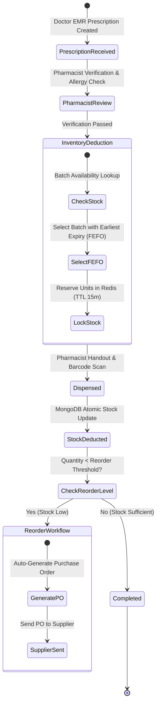
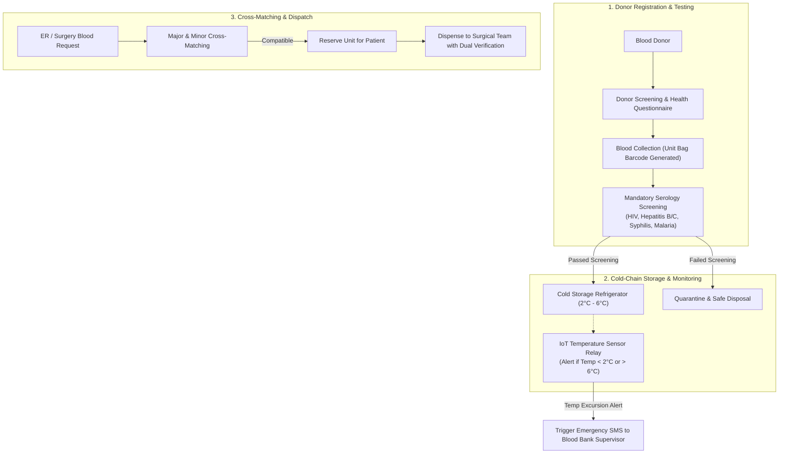
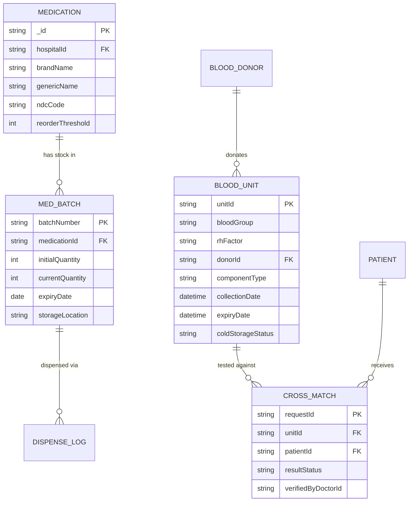

# Pharmacy Inventory, Medication Dispensing & Blood Bank Cold-Chain Architecture

This document defines the architectural specifications for inventory control, automated Medication Fulfillment (FEFO/FIFO rules), Blood Bank Donor matching, and cold-chain temperature monitoring in **MedFlow**.

---

## 1. Pharmacy Inventory & Prescription Fulfillment Pipeline

Medication dispensing follows strict inventory validation and automated stock deduction to prevent stockouts and medication dispensing errors.

### Dispensing Policies:
* **FEFO (First-Expired-First-Out)**: System mandates picking batches with the nearest expiration date to minimize waste.
* **Barcoded Verification**: Scanning medication barcode before dispensing validates National Drug Code (NDC) against prescription.
* **Allergy Cross-Check**: Automated warning system triggers if prescribed drug conflicts with patient's recorded allergies in EMR.

---

## 2. Blood Bank Cold-Chain & Donor Cross-Matching Flow

The Blood Bank management system ensures strict temperature monitoring and donor-to-recipient compatibility checks.

---

## 3. Pharmacy & Blood Bank Data Model (ERD)

---

## 4. Blood Compatibility Matrix

The system enforces compatibility logic prior to reserving blood bags:

| Recipient Blood Type | Compatible Red Cell Units | Compatible Plasma Units |
| :--- | :--- | :--- |
| **O-** | O- only | O-, O+, A-, A+, B-, B+, AB-, AB+ (Universal Donor) |
| **O+** | O-, O+ | O+, A+, B+, AB+ |
| **A-** | O-, A- | A-, A+, AB-, AB+ |
| **A+** | O-, O+, A-, A+ | A+, AB+ |
| **B-** | O-, B- | B-, B+, AB-, AB+ |
| **B+** | O-, O+, B-, B+ | B+, AB+ |
| **AB-** | O-, A-, B-, AB- | AB-, AB+ |
| **AB+** | ALL TYPES (Universal Recipient) | AB+ only |
