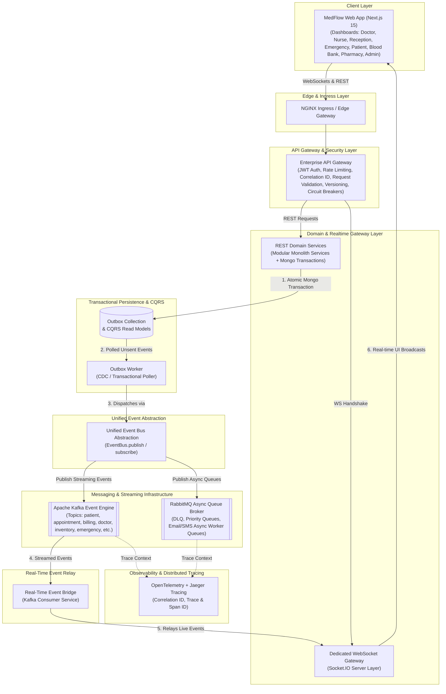

# Real-Time Event-Driven Enterprise Architecture

This document specifies the production-grade real-time event-driven communication topology for the MedFlow Hospital Management System.

## Architecture Diagram (Mermaid)

## Core Architectural Components

1. **NGINX Edge Gateway & API Gateway**: Handles incoming HTTP and WebSocket traffic, SSL termination, JWT validation, Correlation ID injection (`x-correlation-id`, `x-trace-id`), rate limiting, and circuit breaker guards.
2. **REST Domain Services**: Encapsulates core business logic within MongoDB transactions. All domain writes write to primary MongoDB collections and insert an Outbox event within the same atomic session transaction.
3. **Transactional Outbox & Worker**: Ensures 100% reliable event delivery. The Outbox Worker polls MongoDB outbox entries and publishes events to Kafka/RabbitMQ without event loss.
4. **Unified Event Bus (`EventBus`)**: Standardized abstraction (`EventBus.publish()`) handling event envelopes, versioning, trace context propagation, and fallback logic.
5. **Apache Kafka Event Engine**: High-throughput event streaming broker maintaining partitioned topics for analytics, audit logs, and real-time state synchronization.
6. **RabbitMQ Message Queue Broker**: Handles asynchronous background tasks, email/SMS dispatch, dead-letter queues (DLQ), and priority emergency processing.
7. **Dedicated WebSocket Gateway & Real-time Event Bridge**: Decouples domain REST services from WebSocket broadcasting. Kafka event bridge consumer forwards streamed events to the Socket.IO server layer for live UI updates.
8. **Distributed Tracing (OpenTelemetry + Jaeger)**: Tracks requests end-to-end with trace IDs and span IDs across HTTP, Outbox, Kafka, RabbitMQ, and WebSockets.
