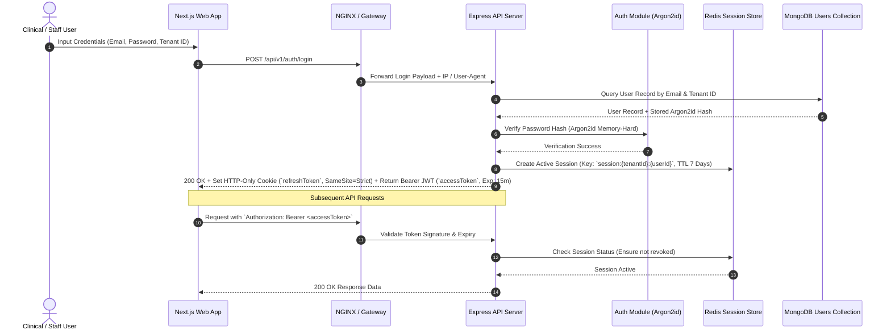
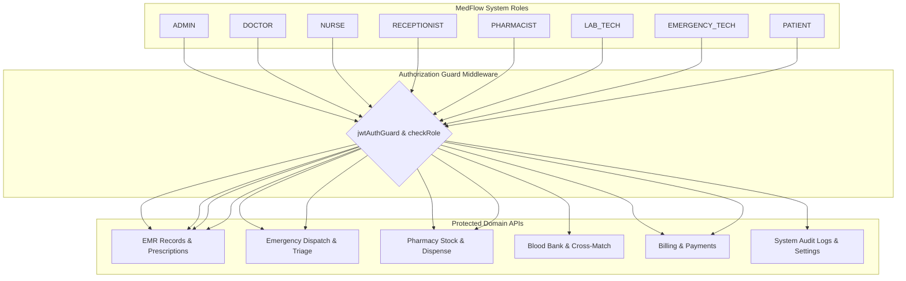
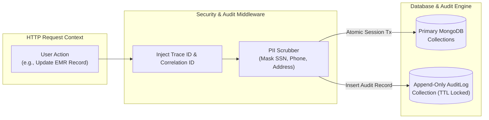

# Security, Authentication, RBAC & Audit Governance Architecture

This document defines the zero-trust security model, multi-tenant authentication scheme, Role-Based Access Control (RBAC) permissions matrix, and tamper-evident audit logging mechanisms for **MedFlow**.

---

## 1. Multi-Tenant Dual-Token Authentication Lifecycle

MedFlow uses a dual-token authentication scheme utilizing Argon2id password hashing, HTTP-Only SameSite refresh cookies, short-lived JWT access tokens, and Redis session tracking.

---

## 2. Role-Based Access Control (RBAC) Permission Matrix

Access permissions are enforced centrally via express middleware (`requireRole([...roles])`).

### RBAC Detailed Matrix:

| Domain Resource | ADMIN | DOCTOR | NURSE | RECEPTION | PHARMACIST | LAB TECH | EMERGENCY | PATIENT |
| :--- | :---: | :---: | :---: | :---: | :---: | :---: | :---: | :---: |
| **User & Tenant Management** | Write | Read | Read | - | - | - | - | - |
| **EMR Records (SOAP, Diagnoses)** | Read | **Full** | Read/Update | - | Read (Prescr) | - | Read | Read (Self) |
| **Appointments & Queue** | Full | Full | Full | **Full** | - | - | - | Read/Book |
| **Emergency Triage & GPS** | Full | Read | Read | Read | - | - | **Full** | SOS Trigger |
| **Pharmacy & Drug Stock** | Full | Read (Meds) | - | - | **Full** | - | - | - |
| **Blood Bank Units & Matching** | Full | Read | - | - | - | **Full** | Read | - |
| **Billing & Stripe Invoices** | **Full** | - | - | Full | - | - | - | Pay Only |
| **Audit Logs & System Specs** | **Full** | - | - | - | - | - | - | - |

---

## 3. Data Scrubbing & Immutable Audit Logging Pipeline

To ensure non-repudiation and regulatory compliance, all write/update actions produce append-only audit entries.

### Audit Log Schema Structure:
* `timestamp`: ISO 8601 UTC timestamp.
* `hospitalId`: Tenant Identifier.
* `userId`: Actor User Identifier.
* `userRole`: Role at execution time.
* `action`: Action verb (`CREATE_EMR`, `DISPENSE_DRUG`, `UPDATE_VITAL`).
* `resourceId`: Affected document `_id`.
* `ipAddress`: Remote client IP address.
* `correlationId`: Tracing UUID.
* `changes`: `{ before: EncryptedHash, after: EncryptedHash }`.
