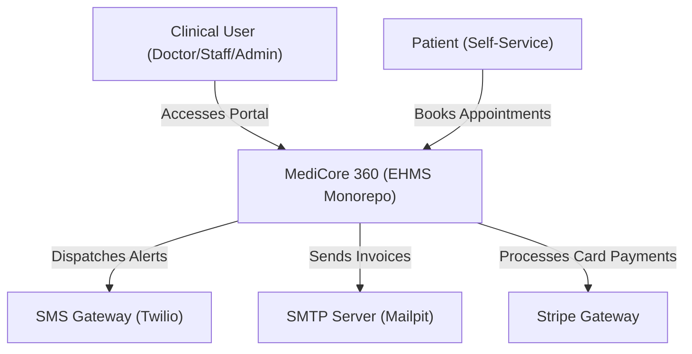
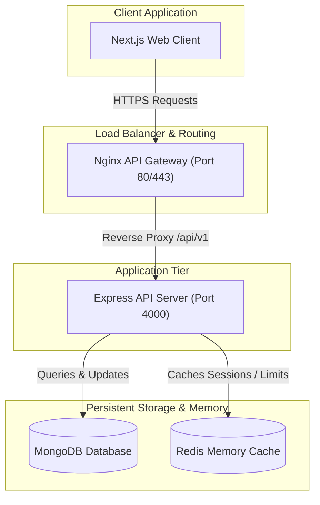
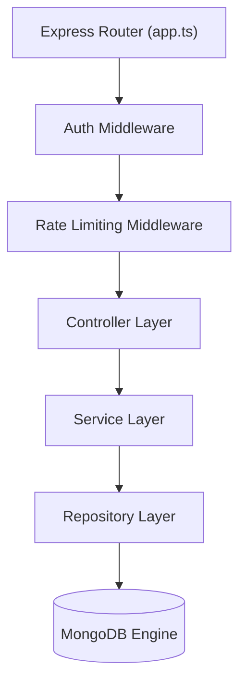
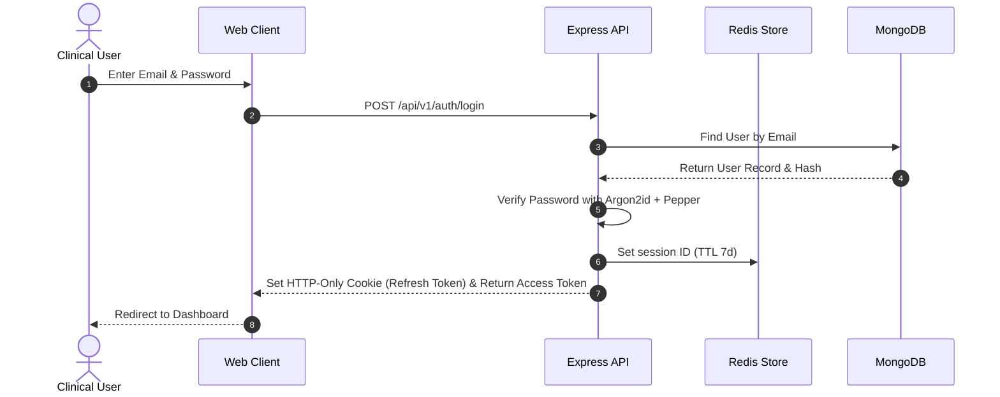
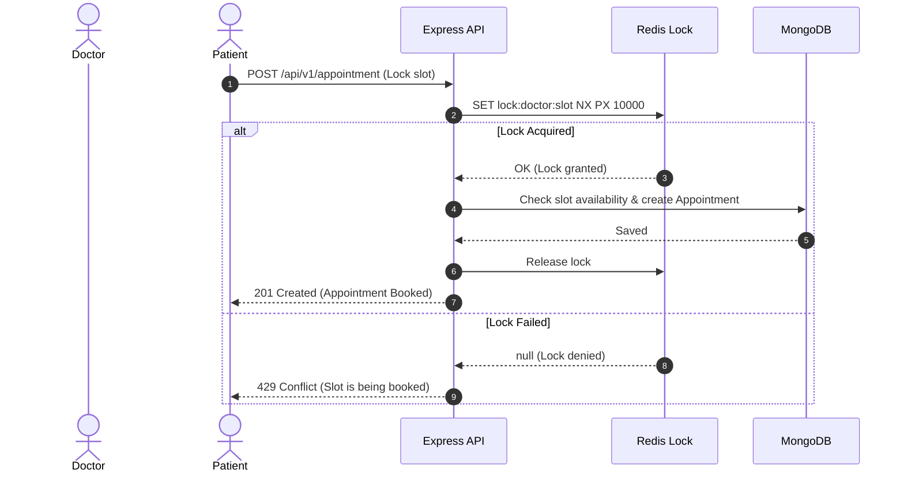
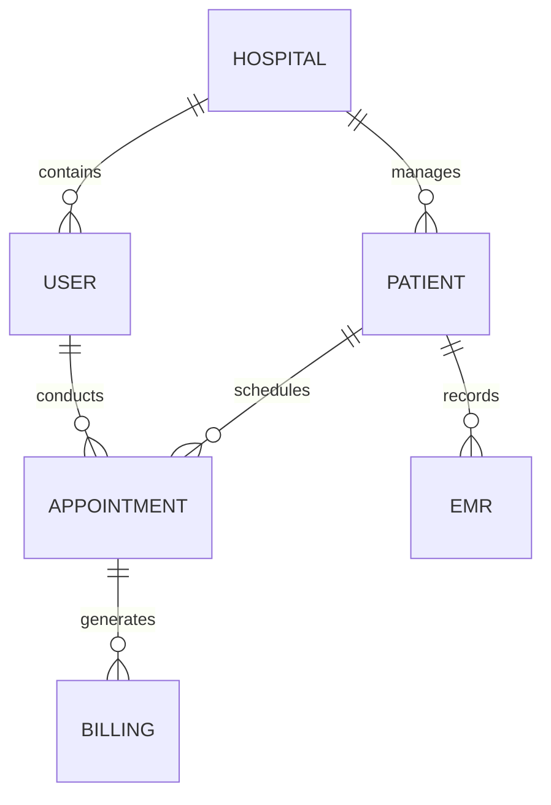

# MediCore 360 - Master Architectural Specifications

This document defines the system topology, C4 models, sequence diagrams, database collection maps, API standards, and reliability targets for **MediCore 360**.

---

## 1. C4 Architecture Diagrams

### 1.1 System Context (Level 1)
Shows how actors interact with MediCore 360:



### 1.2 Container Diagram (Level 2)
Breaks down the system into container boundaries:



### 1.3 Component Diagram (Level 3)
Component routing maps inside the Express API:



---

## 2. Sequence Diagrams

### 2.1 User Login with Session Validation


### 2.2 Appointment Booking with Concurrency Locking


---

## 3. Database Schema Design (MongoDB)

### 3.1 Entity Relationship Diagram (ERD)
Defines relations between collections (tenant-scoped by `hospitalId`):



### 3.2 Indexing Strategy per Collection
To maintain rapid query response times (<50ms):
*   `User`: `{ email: 1 }` (Unique), `{ hospitalId: 1, deletedAt: 1 }` (Compound index)
*   `Patient`: `{ hospitalId: 1, deletedAt: 1 }`, `{ hospitalId: 1, nationalId: 1 }` (Unique partial index)
*   `Appointment`: `{ hospitalId: 1, doctorId: 1, date: 1 }` (Compound index for schedules), `{ createdAt: 1 }`
*   `AuditLog`: `{ hospitalId: 1, createdAt: -1 }` (Compound sorted index)

### 3.3 Sample EMR Schema Document
```json
{
  "_id": "65b47a9ef38877bd64ef0182",
  "hospitalId": "HOSP-001",
  "patientId": "65b47a9ef38877bd64ef0100",
  "doctorId": "65b47a9ef38877bd64ef0101",
  "soapNotes": {
    "subjective": "Encrypted string format...",
    "objective": "Encrypted string format...",
    "assessment": "Encrypted string format...",
    "plan": "Encrypted string format..."
  },
  "diagnoses": ["ICD-10 J06.9", "LOINC 29463-7"],
  "createdAt": "2026-07-21T06:17:47.000Z",
  "deletedAt": null
}
```

---

## 4. API & Reliability Standards

### 4.1 REST Design Guidelines
*   **Versioning**: Mounted on `/api/v1/` prefixes.
*   **Error Envelopes**: Errors return `success: false` alongside standardized code models.
*   **Pagination**: Server limits page size. Offsets utilize standard limits:
    ```
    GET /api/v1/patient?page=1&limit=20&sortBy=createdAt&sortOrder=desc
    ```

### 4.2 SRE Targets & Reliability KPIs
*   **Availability**: Target `99.9%` uptime.
*   **Recovery Metrics**: RTO (Recovery Time Objective) < 4 hours, RPO (Recovery Point Objective) < 1 hour.
*   **SLO/SLIs**: 95% of request processing latency must reside under 500ms.
*   **Monitoring Metrics**:
    *   *Booking latency*: Target < 200ms.
    *   *Redis Cache Hit Ratio*: Target > 80%.

---

## 5. AI Governance & Compliance

To ensure compliance with clinical regulations (e.g. HIPAA):
1.  **HIPAA Data Scrubbing**: Before transmitting transcripts to the AI pipeline, fields matching PII (names, phone numbers, national identification keys) are scrubbed.
2.  **Audit Logs**: All AI prompts, responses, and token usage records are tracked inside the append-only `AuditLog` collection.
3.  **Governance Audits**: Human doctors review generated SOAP summaries and sign off manually.
